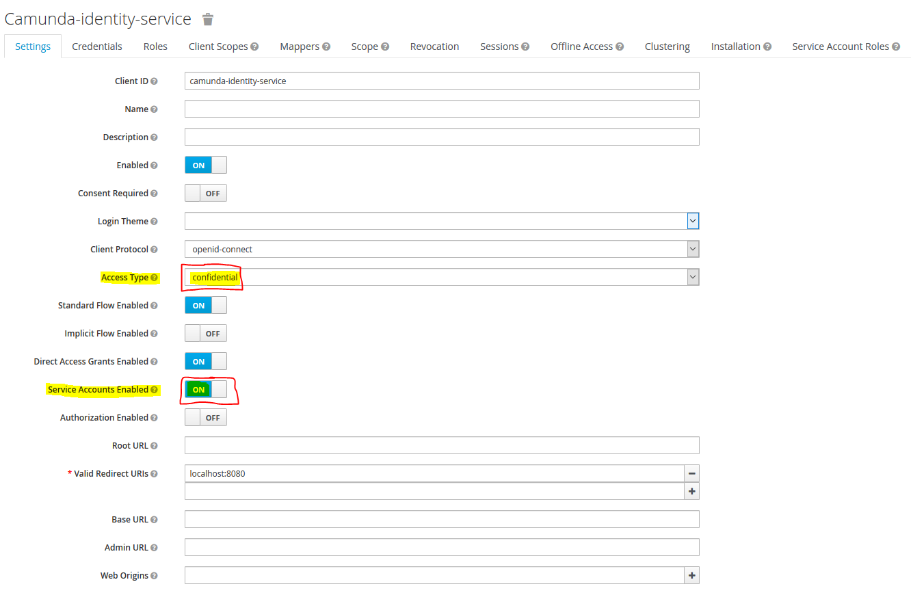
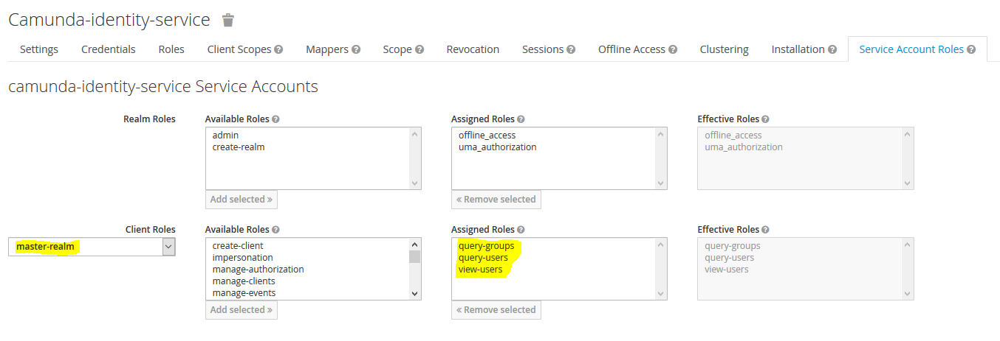
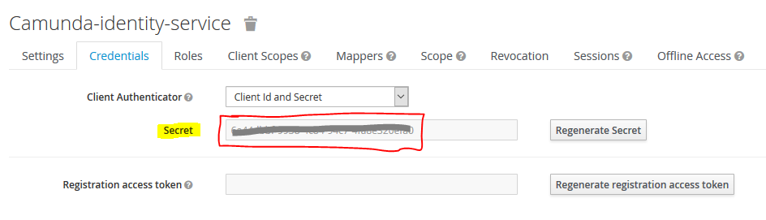

# Keycloak Camunda Identity Provider Plugin

 

Keycloak&trade; (<https://www.keycloak.org/>) is an Open Source Identity and Access Management platform including advanced features such as User Federation, Identity Brokering and Social Login.

Camunda&trade; (<https://camunda.com/>) in it's current version  is perfectly suited to carry out BPM projects in the cloud. Identity management in the cloud, however, often differs from classical approaches. Camunda already provides a generic sample for Single Sign On when using Spring Boot. See <https://github.com/camunda-consulting/code/tree/master/snippets/springboot-security-sso>.
Specific instructions on how to use Spring Boots OAuth2 SSO in combination with this Keycloak Identity Provider Plugin can be found below.

**Why this plugin?** SSO is sufficient in case you only want authentication but have no further advanced security roles. If one needs to use Camundas IdentityService APIs or wants to see actual Users and Groups show up in Cockpit, a custom IdentityProvider needs to be implemented as well.

This plugin provides the basis for using Keycloak as Identity Management solution and will provide a ReadOnlyIdentityProvider. What you will get is a fully integrated solution for using Keycloak as an Identity Provider in Camunda receiving users and groups from Keycloak. The authorization of these users and groups for Camunda resources itself remains within Camunda. This plugin allows the usage of Keycloak as Identity Provider even without SSO.
  
**Beware: in case you want to use Keycloak's advanced login capabilities for social connections you must configure SSO as well.**
Password grant exchanges are only supported for Keycloak's internally managed users and users of an LDAP / Keberos User federation. Hence without SSO you will only be able to login with users managed by such connections.

Features:

*   ReadOnlyIdentityProvider
*   Broad support for user and group queries
*   Compatible with Spring Boot OAuth2 SSO

Current version: `0.6.0-SNAPSHOT` 
Tested with: Keycloak `4.8.3.Final`, Camunda `7.10.0` and Camunda `7.10.3-ee`

Known limitations:

*   A strategy to distinguish SYSTEM and WORKFLOW groups is missing. Currently only the administrator group is mapped to type SYSTEM.
*   Some query filters are applied on the client side - the Keycloak REST API does not allow full criteria search in all required cases.
*   Sort criteria for queries are implemented on the client side - the Keycloak REST API does not allow result ordering.
*   Tenants are currently not supported.

## Prerequisites in your Keycloak realm

1.  Keycloak docker images can be found on [Keycloak Docker Hub](https://hub.docker.com/r/jboss/keycloak/ "Keycloak Docker Images").
2.  Create a new client named `camunda-identity-service` with access type confidential and service accounts enabled:
	
3.	Add the roles `query-groups, query-users, view-users` to the service account client roles of your realm (`master-realm` or `realm-management`, depending on whether you are using master or a separate realm):
	
4.  Your client credentials can be found here:
	

<!--
5.  You can mark groups as Camunda SYSTEM groups by adding an attribute named ``type`` with value ``SYSTEM``. The designated administrator group (see configuration parameter ``administratorGroupName``) is automatically of type SYSTEM. All other groups will be treated as workflow groups.
-->

## Usage with Camuna Spring Boot

Maven Dependencies:

		<dependency>
			<groupId>de.vonderbeck.bpm.identity</groupId>
			<artifactId>camunda-identity-keycloak</artifactId>
			<version>0.6.0-SNAPSHOT</version>
		</dependency>

Add the following class to your Camunda Spring Boot application in order to activate the Keycloak Identity Provider Plugin:

	package <your-package>;
	
	import org.springframework.boot.context.properties.ConfigurationProperties;
	import org.springframework.stereotype.Component;
	import de.vonderbeck.bpm.identity.keycloak.plugin.KeycloakIdentityProviderPlugin;
	
	@Component
	@ConfigurationProperties(prefix="plugin.identity.keycloak")
	public class KeycloakIdentityProvider extends KeycloakIdentityProviderPlugin {
	}

Configuration in `application.yaml` will then look as follows:

	camunda.bpm:
	  ...
	  authorization:
	    enabled: true
	
	plugin.identity.keycloak:
	  keycloakIssuerUrl: https://<your-keycloak-server>/auth/realms/[master|<realm-name>]
	  keycloakAdminUrl: https://<your-keycloak-server>/auth/admin/realms/[master|<realm-name>]
	  clientId: camunda-identity-service
	  clientSecret: 42aa42bb-1234-4242-a24a-42a2b420cde0
	  useEmailAsCamundaUserId: true
	  administratorGroupName: camunda-admin

Hint: the engine must **not** create a user upon startup. Hence you must not configure an `admin-user` for `camunda.bpm` in your `application.yaml`. The following configuration will likely cause errors upon startup: 

	camunda.bpm:
	  admin-user:
	    id: demo
	    password: demo
	    firstName: Camunda

The `admin-user` part must be deleted in order to work properly. The recommended procedure for creating the admin user and admin group in Keycloak is to have the deployment pipeline do this during the environment setup phase.
    
A complete list of configuration options can be found below:

| *Property* | *Description* |
| --- | --- |
| `keycloakIssuerUrl` | The basic issuer URL of your Keycloak server including the realm. Sample for master realm: `https://<your-keycloak-server>/auth/realms/master` |
| `keycloakAdminUrl` | The admin URL of the Keycloak server REST API including the realm. Sample for master realm: `https://<your-keycloak-server>/auth/admin/realms/master` |
| `clientId` | The Client ID of your application. |
| `clientSecret` | The Client Secret of your application. |
| `useEmailAsCamundaUserId` | Whether to use the Keycloak email attribute as Camunda's user ID. Default is `false`.  This is option is a fallback in case you don't use SSO and want to login using Camunda's web interface with your mail address and not the cryptic Keycloak ID. Keep in mind that you will only be able to login without SSO with Keycloak's internally managed users and users managed by the LDAP / Keberos User federation.|
| `administratorGroupName` | The name of the administrator group. If this name is set and engine authorization is enabled, the plugin will create group-level Administrator authorizations on all built-in resources. |
| `administratorUserId` | The ID of the administrator user. If this ID is set and engine authorization is enabled, the plugin will create user-level Administrator authorizations on all built-in resources. |
| `authorizationCheckEnabled` |  If this property is set to true, then authorization checks are performed when querying for users or groups. Otherwise authorization checks are not performed when querying for users or groups. Default: `true`. *Note*: If you have a huge amount of Keycloak users or groups we advise to set this property to false to improve the performance of the user and group query. |
| `maxHttpConnections` | Maximum number HTTP connections for the Keycloak connection pool. Default: `50`|
| `disableSSLCertificateValidation` | Whether to disable SSL certificate validation. Default: `false`. Useful in test environments. | 

## Activating Single Sign On

In this part, we’ll discuss how to activate SSO – Single Sign On – for the Camunda Web App using Spring Boots Security OAuth2 capabilities in combination with this plugin and Keycloak as authorization server.

In order to setup Spring Boot's OAuth2 security add the following Maven dependencies to your project:

		<dependency>
			<groupId>org.springframework.boot</groupId>
			<artifactId>spring-boot-starter-security</artifactId>
		</dependency>
		<dependency>
			<groupId>org.springframework.security.oauth.boot</groupId>
			<artifactId>spring-security-oauth2-autoconfigure</artifactId>
			<version>2.1.2.RELEASE</version>
		</dependency>

Insert a KeycloakAuthenticationProvider as follows:

	/**
	 * OAuth2 Authentication Provider for usage with Keycloak and KeycloakIdentityProviderPlugin. 
	 */
	public class KeycloakAuthenticationProvider extends ContainerBasedAuthenticationProvider {
	
	    @Override
	    public AuthenticationResult extractAuthenticatedUser(HttpServletRequest request, ProcessEngine engine) {
	
	    	// Extract authentication details
	        OAuth2Authentication authentication = (OAuth2Authentication) SecurityContextHolder.getContext().getAuthentication();
	        if (authentication == null) {
	            return AuthenticationResult.unsuccessful();
	        }
	        Authentication userAuthentication = authentication.getUserAuthentication();
	        if (userAuthentication == null || userAuthentication.getDetails() == null) {
	            return AuthenticationResult.unsuccessful();
	        }
	        
	        // Extract user ID from Keycloak authentication result - which is part of the requested user info
	        @SuppressWarnings("unchecked")
	        String userId = ((HashMap<String, String>) userAuthentication.getDetails()).get("sub");
	        if (StringUtils.isEmpty(userId)) {
	            return AuthenticationResult.unsuccessful();
	        }
	
	        // Authentication successful
	        AuthenticationResult authenticationResult = new AuthenticationResult(userId, true);
	        authenticationResult.setGroups(getUserGroups(userId, engine));
	
	        return authenticationResult;
	    }
	
	    private List<String> getUserGroups(String userId, ProcessEngine engine){
	        List<String> groupIds = new ArrayList<>();
	        // query groups using KeycloakIdentityProvider plugin
	        engine.getIdentityService().createGroupQuery().groupMember(userId).list()
	        	.forEach( g -> groupIds.add(g.getId()));
	        return groupIds;
	    }
	
	}
	
Last but not least add a security configuration and enable OAuth2 SSO:

	/**
	 * Camunda Web application SSO configuration for usage with KeycloakIdentityProviderPlugin.
	 */
	@Configuration
	@EnableOAuth2Sso
	public class WebAppSecurityConfig extends WebSecurityConfigurerAdapter {
	
	    @Override
	    protected void configure(HttpSecurity http) throws Exception {
	    	http
	    	.csrf().ignoringRequestMatchers(request -> request.getRequestURI().startsWith("/api"))
	    	.and()
	        .antMatcher("/**")
	        .authorizeRequests()
	          .antMatchers("/app/**")
	          .authenticated()
	        .anyRequest()
	          .permitAll()
	        ;
	    }
	
	    @SuppressWarnings({ "rawtypes", "unchecked" })
	    @Bean
	    public FilterRegistrationBean containerBasedAuthenticationFilter(){
	
	        FilterRegistrationBean filterRegistration = new FilterRegistrationBean();
	        filterRegistration.setFilter(new ContainerBasedAuthenticationFilter());
	        filterRegistration.setInitParameters(Collections.singletonMap("authentication-provider", "de.accso.camunda.showcase.sso.KeycloakAuthenticationProvider"));
	        filterRegistration.setOrder(101); // make sure the filter is registered after the Spring Security Filter Chain
	        filterRegistration.addUrlPatterns("/app/*");
	        return filterRegistration;
	    }
	
	}
	
Finally configure Spring Security with your Keycloak Single Page Web App `client-id` and `client-secret` in `application.yaml` as follows:

	security:
	  basic:
	    enabled: false
	  oauth2:
	    client:
	      client-id: camunda-identity-service
	      client-secret: yyy2121abc21def2121ghi212132121abc21def2121ghi2121eyyy
	      accessTokenUri: https://<your-keycloak-server>/auth/realms/[master|<realm-name>]/protocol/openid-connect/token
	      userAuthorizationUri: https://<your-keycloak-server>/auth/realms/[master|<realm-name>]/protocol/openid-connect/auth
	      scope: openid profile email
	    resource:
	      userInfoUri: https://<your-keycloak-server>/auth/realms/[master|<realm-name>]/protocol/openid-connect/userinfo

**Beware**: SSO will only work that way in case you have the KeycloakIdentityProviderPlugin's property `useEmailAsCamundaUserId` set to default which is `false`. If you want to use the email attribute as Camunda's user ID, the extraction in the Authentication Provider must be implemented as follows:

	// Extract email from Keycloak authentication result - which is part of the requested user info
	@SuppressWarnings("unchecked")
	String userId = ((HashMap<String, String>) userAuthentication.getDetails()).get("email");
	
Keep in mind that Keycloak's `ID` is definitely unique which might not always be the case for the `email` attribute, depending on your setup.
Email uniqueness can be configured on a per realm level depending on the setting *Login with email*.

## Unit testing the plugin

In order to run the unit tests I have used a local docker setup of Keycloak with `docker-compose.yml` as follows:

	version: "3.3"
	
	services:
	  jboss.keycloak:
	    build: .
	    image: jboss/keycloak
	    restart: always
	    environment:
	      TZ: Europe/Berlin
	      KEYCLOAK_USER: keycloak
	      KEYCLOAK_PASSWORD: keycloak1!
	    ports:
	      - "9001:8443"

For details see documentation on [Keycloak Docker Hub](https://hub.docker.com/r/jboss/keycloak/ "Keycloak Docker Images").

------------------------------------------------------------

License: [Apache License 2.0](https://opensource.org/licenses/Apache-2.0)

That's it. Have a happy Keycloak experience and focus on what really matters: the core processes of your customer.

Brought to you by:

[Gunnar von der Beck](https://www.xing.com/profile/Gunnar_vonderBeck/portfolio "XING Profile"), [Accso - Accelerated Solutions GmbH](https://accso.de/ "https://accso.de/")