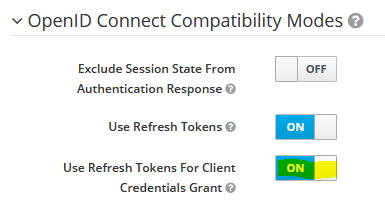
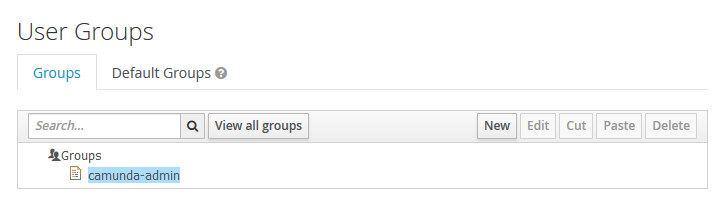

# Keycloak Camunda Identity Provider Plugin
[](https://github.com/camunda-community-hub/community)

[](https://github.com/Camunda-Community-Hub/community/blob/main/extension-lifecycle.md#stable-)
[](https://maven-badges.herokuapp.com/maven-central/org.camunda.bpm.extension/camunda-bpm-identity-keycloak)
 [](./LICENSE)

 

Keycloak&trade; (<https://www.keycloak.org/>) is an Open Source Identity and Access Management platform including advanced features such as User Federation, Identity Brokering and Social Login.

Camunda&trade; (<https://camunda.com/>) in its current version  is perfectly suited to carry out BPM projects in the cloud. Identity management in the cloud, however, often differs from classical approaches. Camunda already provides a generic sample for Single Sign On when using Spring Boot. See <https://github.com/camunda-consulting/code/tree/master/snippets/springboot-security-sso>.
Specific instructions on how to use Spring Boots OAuth2 SSO in combination with this Keycloak Identity Provider Plugin can be found below.

**Why this plugin?** SSO is sufficient in case you only want authentication but have no further advanced security roles. If one needs to use Camundas IdentityService APIs or wants to see actual Users and Groups show up in Cockpit, a custom IdentityProvider needs to be implemented as well.

This plugin provides the basis for using Keycloak as Identity Management solution and will provide a ReadOnlyIdentityProvider. What you will get is a fully integrated solution for using Keycloak as an Identity Provider in Camunda receiving users and groups from Keycloak. The authorization of these users and groups for Camunda resources itself remains within Camunda. This plugin allows the usage of Keycloak as Identity Provider even without SSO.
  
**Beware: in case you want to use Keycloak's advanced login capabilities for social connections you must configure SSO as well.**
Password grant exchanges are only supported for Keycloak's internally managed users and users of an LDAP / Keberos User federation. Hence without SSO you will only be able to login with users managed by such connections.

Current version: `2.2.3`<br >
Tested with: Keycloak >= `5.0.0`, Camunda >= `7.10.0`, `7.10.0-ee`

#### Features

New in Version `2.2.3`:

* Optional Keycloak Login Cache - helps you to minimize password check requests to Keycloak and thus improve performance. Not applicable in SSO scenarios, but useful e.g. when using External Task Clients with Basic Auth.

New in Version `2.2.2`:

* Optimized user / group queries when using single items in `userIdIn(...)` / `groupIdIn(...)` selections

New in Version `2.2.1`:

* Fixed a bug where "like" filters in combination with missing Keycloak attributes (e.g. users without email) may cause a NullPointerException

New in Version `2.2.0`:

* Optional Keycloak Query Cache - helps you to minimize requests to Keycloak and thus improve performance.
* Minor optimization of refresh token handling in case it is missing at all.

New in Version `2.1.0`:

* Auto retry with refreshed new token in case of Keycloak HTTP 401 responses (more stability in case of misconfigurations).

New in Version `2.0.0`:

* Support for Camunda BPM Run
* New options `proxyUri`, `proxyUser`, `proxyPassword` for optional proxy support.
* Usage of `com.google.code.gson` for JSON (de)serialization.
* Further internal refactorings and preparations for future enhancements.

New in Version `1.5.0`:

* New option `maxResultSize` for configuring the maximum result size of queries against the Keycloak REST API.

New in Version `1.4.0`:

* Corrected rare problems with group queries of a single user in case the Keycloak Client name is similar to this username and config property ``useUsernameAsCamundaUserId=true``

New in Version `1.3.0`:

* Provided additional fat `camunda-bpm-identity-keycloak-all.jar` including transitive dependencies for easier installation e.g. on Apache Tomcat distribution with shared engine.

New in Version `1.2.0`:

*   Optimized and correct searches in Keycloak mass data
*   Add missing paging functionality to queries

New in Version `1.1.0`:

* Ability to read group hierarchies.
* New option `useGroupPathAsCamundaGroupId` for readable group IDs. Helps when configuring authorizations.

Version `1.0.0`:

*   ReadOnlyIdentityProvider
*   Broad support for user and group queries
*   Compatible with Spring Boot OAuth2 SSO

Known limitations:

*   A strategy to distinguish SYSTEM and WORKFLOW groups is missing. Currently only the administrator group is mapped to type SYSTEM.
*   Some query filters are applied on the client side - the Keycloak REST API does not allow full criteria search in all required cases.
*   Sort criteria for queries are implemented on the client side - the Keycloak REST API does not allow result ordering.
*   Tenants are currently not supported.

## Prerequisites in your Keycloak realm

1.  Keycloak docker images can be found on [Keycloak Docker Hub](https://hub.docker.com/r/jboss/keycloak/ "Keycloak Docker Images").
2.  Create a new client named `camunda-identity-service` with access type confidential and service accounts enabled:
	
3. In order to use refresh tokens set the "Use Refresh Tokens For Client Credentials Grant" option within the "OpenID Connect Compatibility Modes" section (available in newer Keycloak versions):

	
4.	Add the roles `query-groups, query-users, view-users` to the service account client roles of your realm (choose `realm-management` or `master-realm`, depending on whether you are using a separate realm or master):
	
5.  Your client credentials can be found here:
	
6.  Once you're done with the basic setup you're now ready to manage your users and groups with Keycloak. Please keep in mind, that in order to make the Keycloak Identity Provider work, you will need at least one dedicated Camunda admin group or Camunda admin user in your realm. Whether you create this group/user manually or import it using the LDAP user federation or any other Identity Provider is up to you.
	

## Usage with Camunda Spring Boot

Maven Dependencies:
```xml
<dependency>
    <groupId>org.camunda.bpm.extension</groupId>
    <artifactId>camunda-bpm-identity-keycloak</artifactId>
    <version>2.2.3</version>
</dependency>
```

Add the following class to your Camunda Spring Boot application in order to activate the Keycloak Identity Provider Plugin:

```java
package <your-package>;

import org.springframework.boot.context.properties.ConfigurationProperties;
import org.springframework.stereotype.Component;
import org.camunda.bpm.extension.keycloak.plugin.KeycloakIdentityProviderPlugin;

@Component
@ConfigurationProperties(prefix="plugin.identity.keycloak")
public class KeycloakIdentityProvider extends KeycloakIdentityProviderPlugin {
}
```

Configuration in `application.yaml` will then look as follows:

```yml
camunda.bpm:
  ...
  authorization:
    enabled: true

plugin.identity.keycloak:
  keycloakIssuerUrl: https://<your-keycloak-server>/auth/realms/<realm-name>
  keycloakAdminUrl: https://<your-keycloak-server>/auth/admin/realms/<realm-name>
  clientId: camunda-identity-service
  clientSecret: 42aa42bb-1234-4242-a24a-42a2b420cde0
  useEmailAsCamundaUserId: true
  administratorGroupName: camunda-admin
```

Hint: the engine must **not** create a user upon startup - the plugin is a *ReadOnly*IdentityProvider. Hence you must **not** configure an `admin-user` for `camunda.bpm` in your `application.yaml`. The following configuration will likely cause errors upon startup: 

```yml
camunda.bpm:
# DON'T DO THIS
  admin-user:
    id: demo
    password: demo
    firstName: Camunda
```

The `admin-user` part must be deleted in order to work properly. The recommended procedure for creating the admin user and admin group in Keycloak is to have the deployment pipeline do this during the environment setup phase.
    
A list of configuration options can be found below:

| *Property* | *Description* |
| --- | --- |
| `keycloakIssuerUrl` | The basic issuer URL of your Keycloak server including the realm.<br />Sample for master realm: `https://<your-keycloak-server>/auth/realms/master` |
| `keycloakAdminUrl` | The admin URL of the Keycloak server REST API including the realm.<br />Sample for master realm: `https://<your-keycloak-server>/auth/admin/realms/master` |
| `clientId` | The Client ID of your application. |
| `clientSecret` | The Client Secret of your application. |
| `useEmailAsCamundaUserId` | Whether to use the Keycloak email attribute as Camunda's user ID. Default is `false`.<br /><br />This is option is a fallback in case you don't use SSO and want to login using Camunda's web interface with your mail address and not the cryptic internal Keycloak ID. Keep in mind that you will only be able to login without SSO with Keycloak's internally managed users and users managed by the LDAP / Keberos User federation.|
| `useUsernameAsCamundaUserId` | Whether to use the Keycloak username attribute as Camunda's user ID. Default is `false`. In the default case the plugin will use the internal Keycloak ID as Camunda's user ID.|
| `useGroupPathAsCamundaGroupId` | Whether to use the Keycloak unique group path as Camunda's group ID. Default is `false`. In the default case the plugin will use the internal Keycloak ID as Camunda's group ID.<br />This flag is particularly useful in case you want to have human readable group IDs and recommended when using groups in Camunda's authorization management.<br />*Since 1.1.0* |
| `administratorGroupName` | The name of the administrator group. If this name is set and engine authorization is enabled, the plugin will create group-level Administrator authorizations on all built-in resources. |
| `administratorUserId` | The ID of the administrator user. If this ID is set and engine authorization is enabled, the plugin will create user-level Administrator authorizations on all built-in resources. |
| `authorizationCheckEnabled` |  If this property is set to true, then authorization checks are performed when querying for users or groups. Otherwise authorization checks are not performed when querying for users or groups. Default: `true`.<br />*Note*: If you have a huge amount of Keycloak users or groups we advise to set this property to false to improve the performance of the user and group query. |
| `maxResultSize`| Maximum result size of queries against the Keycloak API. Default: `250`.<br /><br />*Beware*: Setting the parameter to a too low value can lead to unexpected effects. Keep in mind that parts of the filtering takes place on the client side / within the plugin itself. Setting the parameter to a too high value can lead to performance and memory issues.<br />*Since 1.5.0* |
| `maxHttpConnections` | Maximum number HTTP connections for the Keycloak connection pool. Default: `50`|
| `disableSSLCertificateValidation` | Whether to disable SSL certificate validation. Default: `false`. Useful in test environments. |
| `proxyUri` | Optional URI of a proxy to use. Default: `null`, example: `http://proxy:81`.<br />*Since 2.0.0* |
| `proxyUser` | Optional username for proxy authentication. Default: `null`.<br />*Since 2.0.0* |
| `proxyPassword` | Optional password for proxy authentication. Default: `null`.<br />*Since 2.0.0* |
<!--
| `charset` | Charset to use for REST communication with Keycloak Server. Default: `UTF-8`.<br />*Since 1.1.0* |
-->

## Caching options

This is a ReadOnlyIdentityProvider which translates all queries against the Camunda IdentityService in REST queries against Keycloak. Under high load it makes sense to not request the same things again and again, especially since the data of users and groups do not change every second. Therefore this plugin provides an optional cache feature.

### User and group query caching

In order to activate caching of user and group queries you have the following options available:

| *Property* | *Description* |
| --- | --- |
| `cacheEnabled` | Enable caching of user and group queries to Keycloak to improve performance. Default: `false`.<br />*Since 2.2.0* |
| `maxCacheSize` | Maximum size of the cache. Least used entries are evicted when this limit is reached. Default: `500`.<br />*Since 2.2.0* |
| `cacheExpirationTimeoutMin` | Time (in minutes) after which a cached entry is evicted. Default: `15 minutes`.<br />*Since 2.2.0* |

Besides caching of user and group queries there is another scenario where caching could make sense. 

### Login caching

Imagine a setup with lots of External Task Clients using HTTP Basic Auth against the Camunda REST API (e.g. set `camunda.bpm.run.auth.enabled: true` when using Camunda Run). Your External Task Clients then might trigger the IdentityProvider's `checkPassword` function at high frequency. This function requests a token from Keycloak each time it is called. In case of a successful response the login is treated as valid. High frequency then means requesting lots of tokens - in the worst case all for the same user and before an already delivered token has timed out. Therefore this plugin provides an optional login cache feature as well.

In order to activate the login cache you have the following options available:

| *Property* | *Description* |
| --- | --- |
 `loginCacheEnabled` | Enable caching of login / check password requests to Keycloak to improve performance. Not applicable in case of SSO scenarios, but useful e.g. in case of External Tasks clients using HTTP Basic Auth only. Default: `false` <br />*Since 2.2.3* |
| `loginCacheSize` | Maximum size of the login cache. Least used entries are evicted when this limit is reached. Default: `50`.<br />*Since 2.2.3* |
| `loginCacheExpirationTimeoutMin` | Time (in minutes) after which a login cache entry is evicted. Default: `15 minutes`.<br />*Since 2.2.3* |

On the downside this feature bypasses the password grant exchange function of Keycloak until the configured timeout expires. So the choice is yours. Please be aware that the login cache is not applicable for SSO scenarios.

## Activating Single Sign On

In this part, we’ll discuss how to activate SSO – Single Sign On – for the Camunda Web App using Spring Boot and Spring Security 5.2.x OAuth 2.0 Client capabilities in combination with this plugin and Keycloak as authorization server.

In order to setup Spring Boot's OAuth2 security add the following Maven dependencies to your project:

```xml
<dependency>
  <groupId>org.springframework.boot</groupId>
  <artifactId>spring-boot-starter-security</artifactId>
</dependency>
<dependency>
  <groupId>org.springframework.boot</groupId>
  <artifactId>spring-boot-starter-oauth2-client</artifactId>
</dependency>
```

What we need is a bridge between Spring Security and Camunda. Hence insert a KeycloakAuthenticationProvider as follows:

```java
/**
  * OAuth2 Authentication Provider for usage with Keycloak and KeycloakIdentityProviderPlugin. 
  */
public class KeycloakAuthenticationProvider extends ContainerBasedAuthenticationProvider {

    @Override
    public AuthenticationResult extractAuthenticatedUser(HttpServletRequest request, ProcessEngine engine) {

        // Extract user-name-attribute of the OAuth2 token
        Authentication authentication = SecurityContextHolder.getContext().getAuthentication();
        if (!(authentication instanceof OAuth2AuthenticationToken) || !(authentication.getPrincipal() instanceof OidcUser)) {
            return AuthenticationResult.unsuccessful();
        }
        String userId = ((OidcUser)authentication.getPrincipal()).getName();
        if (StringUtils.isEmpty(userId)) {
            return AuthenticationResult.unsuccessful();
        }

        // Authentication successful
        AuthenticationResult authenticationResult = new AuthenticationResult(userId, true);
        authenticationResult.setGroups(getUserGroups(userId, engine));

        return authenticationResult;
    }

    private List<String> getUserGroups(String userId, ProcessEngine engine){
        List<String> groupIds = new ArrayList<>();
        // query groups using KeycloakIdentityProvider plugin
        engine.getIdentityService().createGroupQuery().groupMember(userId).list()
            .forEach( g -> groupIds.add(g.getId()));
        return groupIds;
    }

}
```

Last but not least add a security configuration and enable OAuth2 SSO:

```java
/**
* Camunda Web application SSO configuration for usage with KeycloakIdentityProviderPlugin.
*/
@ConditionalOnMissingClass("org.springframework.test.context.junit.jupiter.SpringExtension")
@Configuration
@Order(SecurityProperties.BASIC_AUTH_ORDER - 10)
public class WebAppSecurityConfig extends WebSecurityConfigurerAdapter {

    @Override
    protected void configure(HttpSecurity http) throws Exception {
        http
        .csrf().ignoringAntMatchers("/api/**")
        .and()
        .requestMatchers().antMatchers("/**").and()
          .authorizeRequests(authorizeRequests ->
            authorizeRequests
            .antMatchers("/app/**", "/api/**", "/lib/**")
            .authenticated()
            .anyRequest()
            .permitAll()
          )
        .oauth2Login()
        ;
    }

    @SuppressWarnings({ "rawtypes", "unchecked" })
    @Bean
    public FilterRegistrationBean containerBasedAuthenticationFilter(){

        FilterRegistrationBean filterRegistration = new FilterRegistrationBean();
        filterRegistration.setFilter(new ContainerBasedAuthenticationFilter());
        filterRegistration.setInitParameters(Collections.singletonMap("authentication-provider", "org.camunda.bpm.extension.keycloak.showcase.sso.KeycloakAuthenticationProvider"));
        filterRegistration.setOrder(101); // make sure the filter is registered after the Spring Security Filter Chain
        filterRegistration.addUrlPatterns("/app/*");
        return filterRegistration;
    }

    @Bean
    @Order(0)
    public RequestContextListener requestContextListener() {
        return new RequestContextListener();
    }
}
```

Finally configure Spring Security with your Keycloak Single Page Web App `client-id` and `client-secret` in `application.yaml` as follows:

```yml
# Spring Boot Security OAuth2 SSO
spring.security.oauth2:
  client:
    registration:
      keycloak:
        provider: keycloak
        client-id: camunda-identity-service
        client-secret: yyy2121abc21def2121ghi212132121abc21def2121ghi2121eyyy
        authorization-grant-type: authorization_code
        redirect-uri: "{baseUrl}/{action}/oauth2/code/{registrationId}"
        scope: openid, profile, email
    provider:
      keycloak:
        issuer-uri: https://<your-keycloak-server>/auth/realms/camunda
        authorization-uri: https://<your-keycloak-server>/auth/realms/camunda/protocol/openid-connect/auth
        user-info-uri: https://<your-keycloak-server>/auth/realms/camunda/protocol/openid-connect/userinfo
        token-uri: https://<your-keycloak-server>/auth/realms/camunda/protocol/openid-connect/token
        jwk-set-uri: https://<your-keycloak-server>/auth/realms/camunda/protocol/openid-connect/certs
        # set user-name-attribute one of: 
        # - sub                -> default; using keycloak ID as camunda user ID
        # - email              -> useEmailAsCamundaUserId=true
        # - preferred_username -> useUsernameAsCamundaUserId=true
        user-name-attribute: email
```

**Beware**: You have to set the parameter ``user-name-attribute`` of the ``spring.security.oauth2.client.provider.keycloak`` in a way that it matches the configuration of your KeycloakIdentityProviderPlugin: 

* `useEmailAsCamundaUserId: true` - set `user-name-attribute: email`
* `useUsernameAsCamundaUserId: true` - set `user-name-attribute: preferred_username`
* neither of the above two, using Keycloak's ID as default - set `user-name-attribute: sub`

Keep in mind that Keycloak's `email` attribute might not always be unique, depending on your setup. Email uniqueness can be configured on a per realm level depending on the setting *Login with email*.

## Quickstart

As a quickstart into using and configuring the plugin we recommend to have a look at the [Installation on Camunda BPM Run](https://github.com/camunda/camunda-bpm-identity-keycloak/tree/master/examples/run). You'll find a chapter "Docker Sample Setup" at the end of the README. This is a simple starting point.

If your intention is a complete SSO setup on Kubernetes you'll be more happy with the next reference.

## Sample Spring Boot Project with SSO on Kubernetes

A sample project using this plugin including a basic SSO and Kubernetes setup can be found under [Camunda Showcase for Spring Boot & Keycloak Identity Provider](https://github.com/camunda/camunda-bpm-identity-keycloak/tree/master/examples/sso-kubernetes). See directory `examples`.

## Installation on Apache Tomcat with Shared Process Engine

Even if from an architectural point of view Spring Boot is currently the most recommended approach for cloud scenarios, it is of course possible to install the plugin in other Camunda distributions as well. A description on how to install the plugin on an Apache Tomcat full distribution can be found under [Installation on Tomcat](https://github.com/camunda/camunda-bpm-identity-keycloak/tree/master/examples/tomcat). See directory `examples`.

## Installation on Camunda BPM Run

A description on how to install the plugin on Camunda BPM Run can be found under [Installation on Camunda BPM Run](https://github.com/camunda/camunda-bpm-identity-keycloak/tree/master/examples/run). See directory `examples`.

## Installation on JBoss/Wildfly

A description on how to install the plugin on a JBoss/Wildfly can be found under [Installation on JBoss/Wildfly](https://github.com/camunda/camunda-bpm-identity-keycloak/tree/master/examples/wildfly). See directory `examples`.

## Unit testing the plugin

In order to run the unit tests I have used a local docker setup of Keycloak with `docker-compose.yml` as follows:

```docker-compose
version: "3.3"

services:
  jboss.keycloak:
    build: .
    image: jboss/keycloak
    restart: always
    environment:
      TZ: Europe/Berlin
      KEYCLOAK_USER: keycloak
      KEYCLOAK_PASSWORD: keycloak1!
    ports:
      - "8443:8443"
```

For details see documentation on [Keycloak Docker Hub](https://hub.docker.com/r/jboss/keycloak/ "Keycloak Docker Images").

### Maven test setup

Running unit tests from Maven requires configuring the details of a running Keycloak server. This can be achieved by setting the following environment variables:

| *Environment Variable* | *Description* |
| --- | --- |
| `KEYCLOAK_URL` | Keycloak server URL.<br />Default value: `https://localhost:8443/auth` |
| `KEYCLOAK_ADMIN_USER` | The admin user of the Keycloak server.<br />Default value: `keycloak` |
| `KEYCLOAK_ADMIN_PASSWORD` | The admin password of the Keycloak server.<br />Default value: `keycloak1!` |

------------------------------------------------------------

That's it. Have a happy Keycloak experience and focus on what really matters: the core processes of your customer.

Brought to you by:


[Gunnar von der Beck](https://www.xing.com/profile/Gunnar_vonderBeck/portfolio "XING Profile"), [Accso - Accelerated Solutions GmbH](https://accso.de/ "https://accso.de/")

------------------------------------------------------------

## Resources

* [Issue Tracker](https://github.com/camunda-community-hub/camunda-bpm-identity-keycloak/issues)
* [Contributing](https://github.com/camunda-community-hub/camunda-bpm-identity-keycloak/blob/master/CONTRIBUTING.md)

## Maintainer

* [Gunnar von der Beck](https://github.com/VonDerBeck)

## License 

License: [Apache License 2.0](https://opensource.org/licenses/Apache-2.0)

