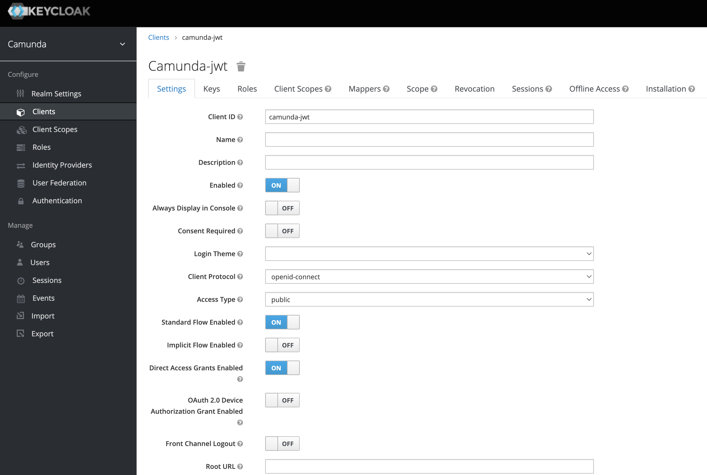
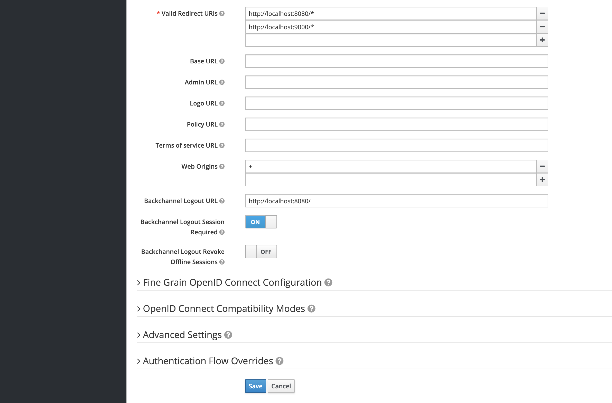

# Camunda Platform 7 - Example for Spring Boot & Keycloak Identity Provider - JWT extension

This is the alternative way, how Keycloak can be configured with client side JWT authentication in Camunda Cockpit.
This configuration does not rely on server side and does not require sticky sessions on your environment.

It is based on javascript integration from Keycloak (keycloak.js) and on example of interceptor for camunda cockpit.

## Prerequisites

1. Configure your Keycloak as described in the main part - [here](https://github.com/camunda-community-hub/camunda-platform-7-keycloak/tree/master/examples#prerequisites-in-your-keycloak-realm)
2. Add additional client for UI access - ``camunda-jwt``

You need to set:
- Access Type - ``public``
- Standard Flow Enabled - ``on``
- Also ``Valid Redirect URIs`` and ``Web Origions`` should be defined




## Usage with Camunda Spring Boot

This section is absolutely the same as described in the main part - [here](https://github.com/camunda-community-hub/camunda-platform-7-keycloak/tree/master/examples#usage-with-camunda-spring-boot)

## Activating Single Sign On

This section is absolutely different from the main part - as we use JWT token directly in the UI - our application works as a resource server

In order to setup Spring Boot's OAuth2 security add the following Maven dependencies to your project:

```xml
<dependency>
  <groupId>org.springframework.boot</groupId>
  <artifactId>spring-boot-starter-security</artifactId>
</dependency>
<dependency>
  <groupId>org.springframework.boot</groupId>
  <artifactId>spring-boot-starter-oauth2-resource-server</artifactId>
</dependency>
```

What we need is a bridge between Spring Security and Camunda. Hence insert a KeycloakAuthenticationProvider as follows:

```java
/**
 * OAuth2 Authentication Provider for usage with Keycloak and KeycloakIdentityProviderPlugin. 
 */
public class KeycloakAuthenticationProvider extends ContainerBasedAuthenticationProvider {

    @Override
    public AuthenticationResult extractAuthenticatedUser(HttpServletRequest request, ProcessEngine engine) {

        // Extract user-name-attribute of the OAuth2 token
        Authentication authentication = SecurityContextHolder.getContext().getAuthentication();
        if (!(authentication instanceof AbstractOAuth2TokenAuthenticationToken) || !(authentication.getPrincipal() instanceof Jwt)) {
            return AuthenticationResult.unsuccessful();
        }
        String userId = ((Jwt)authentication.getPrincipal()).getClaimAsString("preferred_username");
        if (!StringUtils.hasLength(userId)) {
            return AuthenticationResult.unsuccessful();
        }

        // Authentication successful
        AuthenticationResult authenticationResult = new AuthenticationResult(userId, true);
        authenticationResult.setGroups(getUserGroups(userId, engine));

        return authenticationResult;
    }

    private List<String> getUserGroups(String userId, ProcessEngine engine){
        List<String> groupIds = new ArrayList<>();
        // query groups using KeycloakIdentityProvider plugin
        engine.getIdentityService().createGroupQuery().groupMember(userId).list()
                .forEach( g -> groupIds.add(g.getId()));
        return groupIds;
    }

}
```

Last but not least add a security configuration and enable OAuth2 SSO:

```java
/**
 * Camunda Web application SSO configuration for usage with KeycloakIdentityProviderPlugin.
 */
@ConditionalOnMissingClass("org.springframework.test.context.junit.jupiter.SpringExtension")
@Configuration
@Order(SecurityProperties.BASIC_AUTH_ORDER - 10)
public class WebAppSecurityConfig extends WebSecurityConfigurerAdapter {

    private static final int AFTER_SPRING_SECURITY_FILTER_CHAIN_ORDER = 201;
    private static final String API_FILTER_PATTERN = "/api/*";
    private static final String AUTHENTICATION_FILTER_NAME = "Authentication Filter";
    private static final String CSRF_PREVENTION_FILTER_NAME = "CsrfPreventionFilter";


    @Inject
    private CamundaBpmProperties camundaBpmProperties;

    @Override
    protected void configure(HttpSecurity http) throws Exception {
        String path = camundaBpmProperties.getWebapp().getApplicationPath();
        http
                .authorizeRequests(authz -> authz
                        .antMatchers( "/").permitAll()
                        .antMatchers(path + "/app/**").permitAll()
                        .antMatchers(path + "/lib/**").permitAll()
                        .antMatchers(path + "/api/engine/engine/**").permitAll()
                        .antMatchers(path + "/api/*/plugin/*/static/app/plugin.css").permitAll()
                        .antMatchers(path + "/api/*/plugin/*/static/app/plugin.js").permitAll()
                        .anyRequest().authenticated())
                .oauth2ResourceServer(oauth2 -> oauth2.jwt());
    }

    @SuppressWarnings({ "rawtypes", "unchecked" })
    @Bean
    public FilterRegistrationBean containerBasedAuthenticationFilter(){
        String camundaWebappPath = camundaBpmProperties.getWebapp().getApplicationPath();

        FilterRegistrationBean filterRegistration = new FilterRegistrationBean();
        filterRegistration.setFilter(new StatelessAuthenticationFilter());
        filterRegistration.setInitParameters(Collections.singletonMap("authentication-provider", "org.camunda.bpm.extension.keycloak.showcase.sso.KeycloakAuthenticationProvider"));

        filterRegistration.setName(AUTHENTICATION_FILTER_NAME);
        filterRegistration.setOrder(AFTER_SPRING_SECURITY_FILTER_CHAIN_ORDER);
        filterRegistration.addUrlPatterns(camundaWebappPath + API_FILTER_PATTERN);
        return filterRegistration;
    }

    /**
     * Configuration for disabling CSRF filter.
     * In new Camunda version (7.11) was added special protection header with {@link org.camunda.bpm.webapp.impl.security.filter.CsrfPreventionFilter}
     * that expects a CSRF Token on any modifying request coming through the /api/* url.
     * If no CSRF Token is present, any requests mapped to "/api" will fail.
     * To solve this problem, Camunda CsrfPreventionFilter must be overridden.
     *
     * @return servlet context initializer
     * @see <a href="https://docs.camunda.org/manual/latest/update/minor/710-to-711/#http-header-security-in-webapps">Camunda docs</a>
     * @see <a href="https://forum.camunda.org/t/how-to-disable-csrfpreventionfilter/13095/9">Solution from Camunda forum</a>
     */
    @Bean
    public FilterRegistrationBean<Filter> csrfOverwriteFilter() {
        String camundaWebappPath = camundaBpmProperties.getWebapp().getApplicationPath();

        FilterRegistrationBean<Filter> filterRegistration = new FilterRegistrationBean<>();
        filterRegistration.setFilter((request, response, chain) -> chain.doFilter(request, response));
        filterRegistration.setName(CSRF_PREVENTION_FILTER_NAME);
        filterRegistration.setOrder(AFTER_SPRING_SECURITY_FILTER_CHAIN_ORDER);
        filterRegistration.addUrlPatterns(camundaWebappPath + API_FILTER_PATTERN);
        return filterRegistration;
    }

    @Bean
    @Order(0)
    public RequestContextListener requestContextListener() {
        return new RequestContextListener();
    }

}
```

Finally configure Spring Security JWT resource server by providing issuer URI as follows:

```yml
# Spring Boot Security OAuth2 SSO
spring.security:
  oauth2:
    resourceserver:
      jwt:
        issuer-uri: https://<your-keycloak-server>/auth/realms/camunda
```

Also for camunda 7.18+ you need to configure CSP header:
```yml
#CSP header configuration (Camunda 7.18+)
camunda.bpm:
  webapp:
    header-security:
      content-security-policy-value=: "base-uri 'self';
                                        script-src $NONCE 'strict-dynamic' 'unsafe-eval' https: 'self' 'unsafe-inline';
                                        style-src 'unsafe-inline' 'self';
                                        connect-src ${keycloak.url.plugin} 'self';
                                        default-src 'self';
                                        img-src 'self' data:;
                                        block-all-mixed-content;form-action 'self';
                                        frame-ancestors 'none';object-src 'none';
                                        sandbox allow-forms allow-scripts allow-same-origin allow-popups allow-downloads"

```

## Client side part


#### Enabling Keycloak.js of the client side

You'll find the custom configuration for Camunda Cockpit UI under ``src/main/resources/META-INF/resources/webjars/camunda``. Rely on this directory as a base directory for the next 3 steps. 

1. In order to provide Keycloak configuration on the UI's side you have to create ``keycloak.json`` file, located in the ``app/identity-keycloak/scripts/`` directory of the Camunda webapps. It simply configures JSON file with keycloak configuration:
```json
{
  "url": "https://<your-keycloak-server>/auth/",
  "realm": "camunda",
  "clientId": "camunda-jwt"
}
```

2. Copy ``keycloak.min.js`` file from your Keycloak server (located at ``https://<your-keycloak-server>/auth/js/keycloak.min.js`` ) to the ``app/identity-keycloak/scripts/`` directory of the Camunda webapps. 


3. To enable JWT authorization plugin on the client side you have to provide a custom ``config.js`` file, located in the ``app/{admin|cockpit|tasklist|welcome}/scripts/`` directory of the Camunda webapps. It simply configures a custom authentication script:

```javascript
export default {
    customScripts: [
        '../identity-keycloak/scripts/identity-keycloak-auth.js'
    ]
};
```
