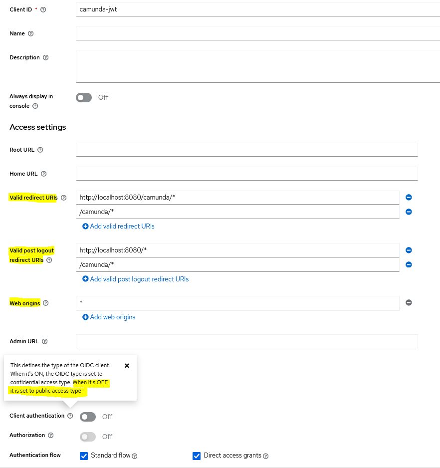
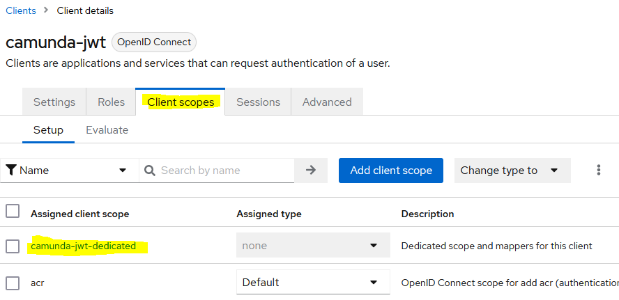
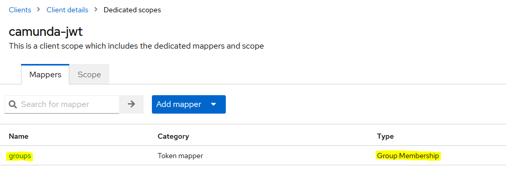
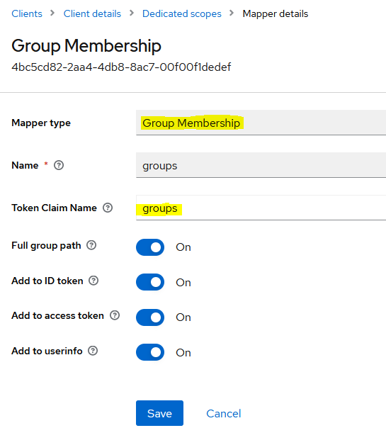

# Camunda Platform 7 - Example for Spring Boot & Keycloak Identity Provider - JWT extension

This is the alternative way, how Keycloak can be configured with client side JWT authentication in Camunda Cockpit.
This configuration does not rely on server side and does not require sticky sessions on your environment.

It is based on javascript integration from Keycloak (keycloak.js) and an interceptor for Camunda Cockpit.

**Beware:** this is still in incubation / preview status and might change in the future.

## Prerequisites

1. Configure Keycloak as described in the main part - [here](https://github.com/camunda-community-hub/camunda-platform-7-keycloak/tree/master/examples#prerequisites-in-your-keycloak-realm)
2. Add additional client for UI access - ``camunda-jwt``

You need to set:
- Access Type - ``public``
- Standard Flow Enabled - ``on``
- Also ``Valid Redirect URIs`` and ``Web Origions`` should be defined



The setup additionally requires the registration of a group mapper under the `camunda-jwt-dedicated` client scope,
allowing us to extract groups from the corresponding token claim.




## Usage with Camunda Spring Boot

The integration basics are absolutely the same as described in the main part - [here](https://github.com/camunda-community-hub/camunda-platform-7-keycloak/tree/master/examples#usage-with-camunda-spring-boot)

Your dependency for the Keycloak Identity Provider still is:

```xml
    <dependency>
        <groupId>org.camunda.bpm.extension</groupId>
        <artifactId>camunda-platform-7-keycloak</artifactId>
    </dependency>
```

## Activating Single Sign On

Activating single sign on differes from the main part - as we use JWT tokens directly in the UI. Our application now works as a resource server.

First of all we need an additional dependency which does most of the magic:

```xml
    <dependency>
        <groupId>org.camunda.bpm.extension</groupId>
        <artifactId>camunda-platform-7-keycloak-jwt</artifactId>
    </dependency>
```

In order to setup Spring Boot's OAuth2 security add the following Maven dependencies to your project:

```xml
<dependency>
  <groupId>org.springframework.boot</groupId>
  <artifactId>spring-boot-starter-security</artifactId>
</dependency>
<dependency>
  <groupId>org.springframework.boot</groupId>
  <artifactId>spring-boot-starter-oauth2-resource-server</artifactId>
</dependency>
```

With all that stuff in place we then need a Web Security Configuration as follows:

```java
@Configuration
@Order(SecurityProperties.BASIC_AUTH_ORDER - 10)
public class WebAppSecurityConfig extends WebSecurityConfigurerAdapter {

    private static final int AFTER_SPRING_SECURITY_FILTER_CHAIN_ORDER = 201;
    private static final String API_FILTER_PATTERN = "/api/*";
    private static final String AUTHENTICATION_FILTER_NAME = "Authentication Filter";

    @Inject
    private CamundaBpmProperties camundaBpmProperties;

    @Inject
    private KeycloakCockpitConfiguration keycloakCockpitConfiguration;

    @Override
    protected void configure(HttpSecurity http) throws Exception {
        String path = camundaBpmProperties.getWebapp().getApplicationPath();
        http
                .csrf().ignoringAntMatchers("/api/**", "/engine-rest/**")
                .and()
                .requestMatchers().antMatchers("/**").and()
                .authorizeRequests(authz -> authz
                        .antMatchers( "/").permitAll()
                        .antMatchers(path + "/app/**").permitAll()
                        .antMatchers(path + "/lib/**").permitAll()
                        .antMatchers(path + "/api/engine/engine/**").permitAll()
                        .antMatchers(path + "/api/*/plugin/*/static/app/plugin.css").permitAll()
                        .antMatchers(path + "/api/*/plugin/*/static/app/plugin.js").permitAll()
                        .anyRequest().authenticated())
                .oauth2ResourceServer(oauth2 -> oauth2.jwt());
    }

    @SuppressWarnings({ "rawtypes", "unchecked" })
    @Bean
    public FilterRegistrationBean containerBasedAuthenticationFilter() {
        String camundaWebappPath = camundaBpmProperties.getWebapp().getApplicationPath();

        FilterRegistrationBean filterRegistration = new FilterRegistrationBean();
        filterRegistration.setFilter(new KeycloakJwtAuthenticationFilter());
        filterRegistration.setInitParameters(Collections.singletonMap("authentication-provider", "org.camunda.bpm.extension.keycloak.auth.KeycloakJwtAuthenticationProvider"));
        filterRegistration.setName(AUTHENTICATION_FILTER_NAME);
        filterRegistration.setOrder(AFTER_SPRING_SECURITY_FILTER_CHAIN_ORDER);
        filterRegistration.addUrlPatterns(camundaWebappPath + API_FILTER_PATTERN);
        return filterRegistration;
    }

    @Bean
    public FilterRegistrationBean cockpitConfigurationFilter() {
        return new KeycloakConfigurationFilterRegistrationBean(
                keycloakCockpitConfiguration,
                camundaBpmProperties.getWebapp().getApplicationPath()
        );
    }

    @Bean
    @Order(0)
    public RequestContextListener requestContextListener() {
        return new RequestContextListener();
    }
}
```

The Web Security configuration is responsible for
* Registering the `KeycloakJwtAuthenticationFilter` with the `KeycloakJwtAuthenticationProvider` acting as a bridge between Keycloak and Camunda.
* Registering the `KeycloakConfigurationFilterRegistrationBean` which provides access to the Keycloak server configuration.

Finally you have to configure the Keycloak Server and Client as well as the Spring Security JWT resource server by providing issuer URI as follows:

```yml
# Camunda Cockpit JWT Plugin
plugin.cockpit.keycloak:
  keycloakUrl: https://<your-keycloak-server>
  realm: camunda
  clientId: camunda-jwt

# Spring Boot Security OAuth2 SSO
spring.security:
  oauth2:
    resourceserver:
      jwt:
        issuer-uri: https://<your-keycloak-server>/realms/camunda
```

Also for camunda 7.18+ you need to configure CSP header:
```yml
#CSP header configuration (Camunda 7.18+)
camunda.bpm:
  webapp:
    header-security:
      content-security-policy-value=: "base-uri 'self';
                                        script-src $NONCE 'strict-dynamic' 'unsafe-eval' https: 'self' 'unsafe-inline';
                                        style-src 'unsafe-inline' 'self';
                                        connect-src ${plugin.cockpit.keycloak.keycloakUrl} 'self';
                                        default-src 'self';
                                        img-src 'self' data:;
                                        block-all-mixed-content;form-action 'self';
                                        frame-ancestors 'none';object-src 'none';
                                        sandbox allow-forms allow-scripts allow-same-origin allow-popups allow-downloads"

```

Now you are ready for the last step: activate Keycloak on the client side.

### Enabling `keycloak.js` in Camunda Web Applications

You'll find the custom configuration for Camunda Cockpit UI under ``src/main/resources/META-INF/resources/webjars/camunda``. Rely on this directory as a base directory for the next step. 

To enable the JWT authorization plugin on the client side you have to provide a custom ``config.js`` file, located in the ``app/{admin|cockpit|tasklist|welcome}/scripts/`` directory of the Camunda webapps. It simply configures a custom authentication script:

```javascript
export default {
    customScripts: [
        '../identity-keycloak/scripts/identity-keycloak-auth.js'
    ]
};
```

The referenced script takes care of loading `<keycloakserver>/js/keycloak.min.js` from your Keycloak server and integrates the Authorization into the Cockpit app
using parameters as configured in the Spring Boot config file.