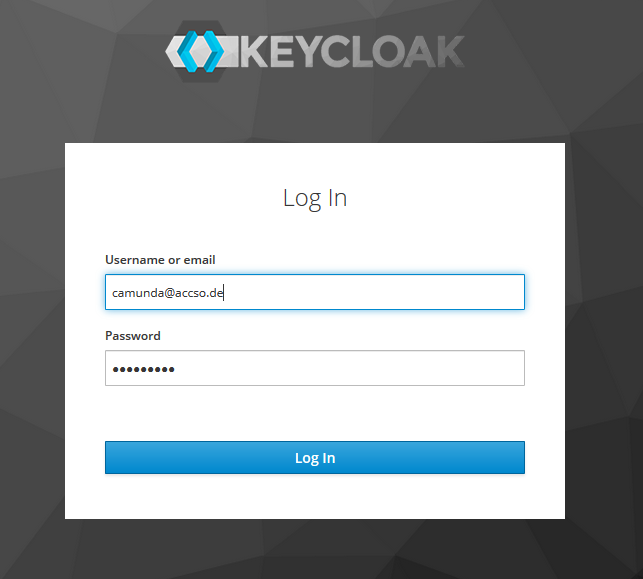
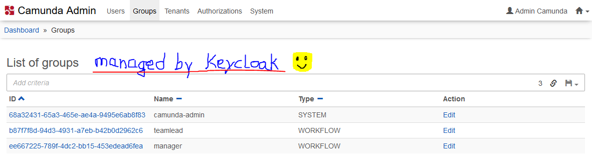
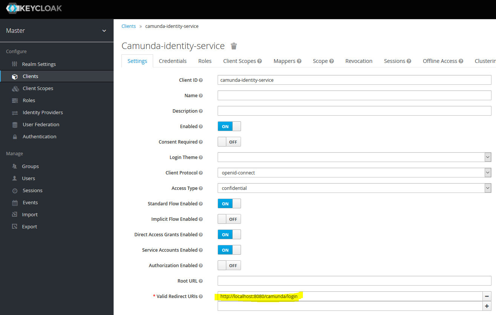
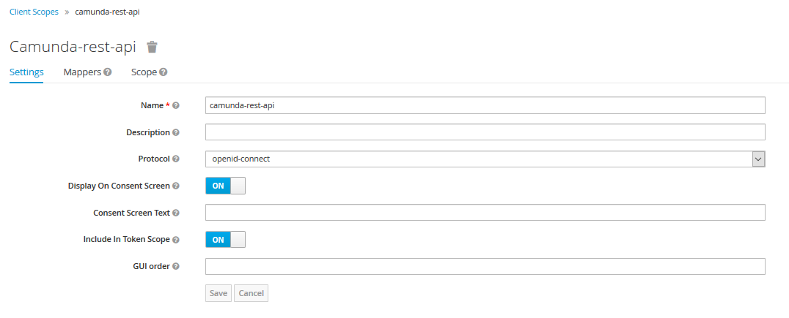
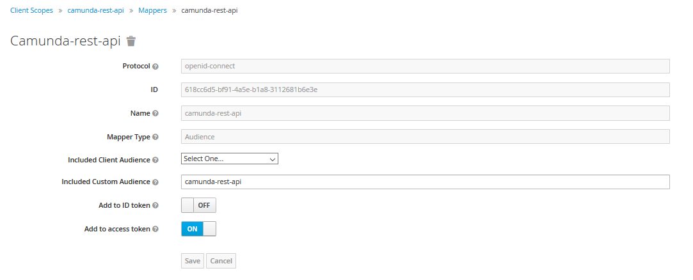
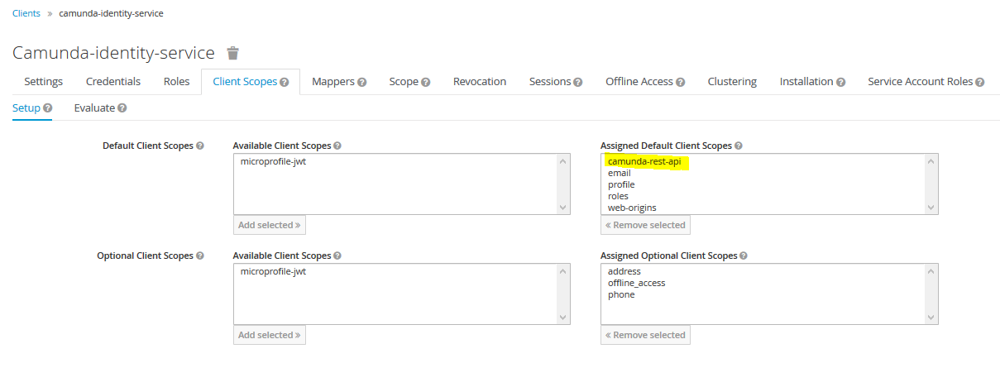
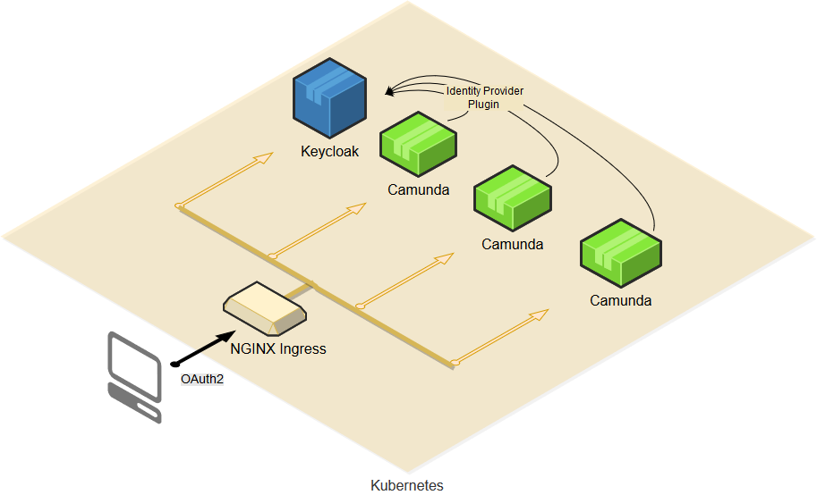

# Camunda Showcase for Spring Boot & Keycloak Identity Provider

## What it does

This is a basic showcase for a Camunda Spring Boot application using the [Keycloak Identity Provider Plugin](https://github.com/camunda/camunda-bpm-identity-keycloak) in combination with the OAuth 2.0 Client and Resource Server implementation of Spring Security 5.2.x.

You will not only login using Keycloak (or if configured using your preferred social identity provider)

 

but most importantly get Users and Groups in Camunda managed by Keycloak as well

 

## Prerequisites

* In order to run the project as Spring Boot App you will need JDK 8, Maven.
* The optional Docker build requires only Docker itself. It uses JDK 11, Maven within a multi-stage Docker build.
* The optional Kubernetes setup requires the NGINX Ingress Controller.

## Build process

The build process uses Maven.

<table>
    <tr>
        <td><b>Target</b></td>
        <td>&nbsp;</td>
        <td><b>Maven Goal</b></td>
    </tr>
    <tr>
        <td>Build Spring Boot Jar</td>	
        <td>&nbsp;</td>
        <td><code>clean install</code></td>	
    </tr>
    <tr>
    	<td>Run Spring Boot App</td>
        <td>&nbsp;</td>
    	<td><code>spring-boot:run</code></td>
    </tr>
</table>

## Show me the important parts

The following description is a quick start. A more detailed description will follow.

### Run it

1.  Start Keycloak Server as described below.
2.  Run this project as Spring Boot App.
3.  Point a new private window of your browser to ``localhost:8080/camunda``
4.  Login with camunda@accso.de / camunda1!
5.  Choose the admin console and browse users and groups from Keycloak

### Keycloak server - local test setup

Use a ``docker-compose.yml`` file as follows:

	version: "3.3"
	
	services:
	  jboss.keycloak:
	    build: .
	#    image: jboss/keycloak:10.0.1
	    image: gunnaraccso/keycloak.server:10.0.1
	    restart: always
	    environment:
	      TZ: Europe/Berlin
	      KEYCLOAK_USER: keycloak
	      KEYCLOAK_PASSWORD: keycloak1!
	    ports:
	      - "9001:8443"
	      - "9000:8080"

The image ``gunnaraccso/keycloak.server`` has been derived from the original ``jboss/keycloak`` docker image. It additionally includes a basic test setup matching the test configuration of this project. The image exists only for demonstration purposes. Do not use in production. For original Keycloak docker images see [Keycloak Docker image](https://hub.docker.com/r/jboss/keycloak/).

The only thing you have to adapt for local tests is the **Redirect URI** of the Camuna Identity Service Client. Login at the [Keycloak Admin Console](https://localhost:9001/auth/admin/master/console/#/) using user/password as configured above and add ``http://localhost:8080/camunda/*`` as Valid Redirect URI configuration to the Camunda Identity Service client:

 

For further details on how to setup a Keycloak Camunda Identity Service Client see documentation of [Keycloak Identity Provider Plugin](https://github.com/camunda/camunda-bpm-identity-keycloak). The optional setup for securing Camunda's REST Api is described in the chapters below.

### Keycloak Identity Provider Plugin

The class ``KeycloakIdentityProvider.java`` in package ``org.camunda.bpm.extension.keycloak.showcase.plugin`` will activate the plugin.

The main configuration part in ``applicaton.yaml`` is as follows:

	# Externalized Keycloak configuration
	keycloak:
	  # Keycloak access for the Identity Provider plugin.
	  url.plugin: ${KEYCLOAK_URL_PLUGIN:https://localhost:9001}

	  # Keycloak Camunda Identity Client
	  client.id: ${KEYCLOAK_CLIENT_ID:camunda-identity-service}
	  client.secret: ${KEYCLOAK_CLIENT_SECRET:42xx42xx-a17b-c63d-e26f-42xx42xx42xx42xx}

	# Camunda Keycloak Identity Provider Plugin
	plugin.identity.keycloak:
	  keycloakIssuerUrl: ${keycloak.url.plugin}/auth/realms/camunda
	  keycloakAdminUrl: ${keycloak.url.plugin}/auth/admin/realms/camunda
	  clientId: ${keycloak.client.id}
	  clientSecret: ${keycloak.client.secret}
	  useEmailAsCamundaUserId: true
	  useUsernameAsCamundaUserId: false
	  useGroupPathAsCamundaGroupId: true
	  administratorGroupName: camunda-admin
	  disableSSLCertificateValidation: true
  
For configuration details of the plugin see documentation of [Keycloak Identity Provider Plugin](https://github.com/camunda/camunda-bpm-identity-keycloak) 

### OAuth2 SSO Configuration

For OAuth2 SSO configuration see package ``org.camunda.bpm.extension.keycloak.showcase.sso``.

The additional configuration parts in ``applicaton.yaml`` are as follows:

	# Externalized Keycloak configuration
	keycloak:
	  # SSO Authentication requests. Send by application as redirect to the browser
	  url.auth: ${KEYCLOAK_URL_AUTH:http://localhost:9000}
	  # SSO Token requests. Send from the application to Keycloak
	  url.token: ${KEYCLOAK_URL_TOKEN:http://localhost:9000}

	# Spring Boot Security OAuth2 SSO
	spring.security:
	oauth2:
		client:
		registration:
			keycloak:
			provider: keycloak
			client-id: ${keycloak.client.id}
			client-secret: ${keycloak.client.secret}
			authorization-grant-type: authorization_code
			redirect-uri: "{baseUrl}/{action}/oauth2/code/{registrationId}"
			scope: openid, profile, email
		provider:
			keycloak:
			token-uri: ${keycloak.url.token}/auth/realms/camunda/protocol/openid-connect/token
			authorization-uri: ${keycloak.url.auth}/auth/realms/camunda/protocol/openid-connect/auth
			user-info-uri: ${keycloak.url.auth}/auth/realms/camunda/protocol/openid-connect/userinfo
			jwk-set-uri: ${keycloak.url.token}/auth/realms/camunda/protocol/openid-connect/certs
			issuer-uri: ${keycloak.url.token}/auth/realms/camunda
			# set user-name-attribute one of: 
			# - sub                -> default; using keycloak ID as camunda user ID
			# - email              -> useEmailAsCamundaUserId=true
			# - preferred_username -> useUsernameAsCamundaUserId=true
			user-name-attribute: preferred_username

You'll find the security configuraton setup in ``WebAppSecurityConfig``. Please be aware of the ``KeycloakAuthenticationProvider`` which is the bridge between Spring Security and Camunda.

### Optional Security for the Camunda REST Api

In order to secure Camunda's REST Api we're using standard JWT combined with Keycloaks JWKS capabilities. Which implies

* In order to use the engine's REST interface a client must first obtain a token from the Keycloak server
* This token must be included in the REST request as authentication header
* The job of the REST Api Security is to validate the token and then extract user id and groupIds
* The token signature is checked by requesting the corresponding public key from Keycloak using its JWKS endpoint
* Further token validation includes expiry and audience claims

The additional configuration in ``application.yaml`` is simple and self explaining:

	# Camunda Rest API
	rest.security:
	  enabled: true
	  provider: keycloak
	  required-audience: camunda-rest-api

To induce keycloak to include the expected audience claim in delivered tokens, we configure a custom Client Scope named ``camunda-rest-api``:

We need to add a mapper with type ``Audience`` and configure the required audience ``camunda-rest-api``

Finally we assign the created Client Scope to our existing Camunda-Identity-Service used for authentication:

This ensures, that only users authenticated at the Camunda-Identity-Service are allowed to access Camunda's REST API. Fine grained configuration of the authorization rights can be achieved by adding rules to Camunda's Authorization configuration.

The security implementation snippets for the REST Api part can be found in package ``org.camunda.bpm.extension.keycloak.showcase.rest``. 

Besides a typical Web security configuration ``RestApiSecurityConfig`` including OAuth 2.0 Resource Server support we need a ``KeycloakAuthenticationFilter`` registered at the end of the Spring Security Filter Chain. It's job is to pass the authenticated user id and groupIds to Camunda's IdentityService:

	@Override
	public void doFilter(ServletRequest request, ServletResponse response, FilterChain chain)
			throws IOException, ServletException {

	    // Extract user-name-attribute of the JWT / OAuth2 token
		Authentication authentication = SecurityContextHolder.getContext().getAuthentication();
		String userId = null;
		if (authentication instanceof JwtAuthenticationToken) {
			userId = ((JwtAuthenticationToken)authentication).getName();
		} else if (authentication.getPrincipal() instanceof OidcUser) {
			userId = ((OidcUser)authentication.getPrincipal()).getName();
		} else {
			throw new ServletException("Invalid authentication request token");
		}
        if (StringUtils.isEmpty(userId)) {
        	throw new ServletException("Unable to extract user-name-attribute from token");
        }

        LOG.debug("Extracted userId from bearer token: {}", userId);

        try {
        	identityService.setAuthentication(userId, getUserGroups(userId));
        	chain.doFilter(request, response);
        } finally {
        	identityService.clearAuthentication();
        }
	}

A unit test checking the REST Api security is provided in class ``RestApiSecurityConfigTest``. Please be aware that the unit test requires a running Keycloak Server including the setup described above. Therefore it is ignored as standard.

## Kubernetes Setup

Finally - a quick introduction on how to setup Keycloak and this showcase on Kubernetes.

Before we turn to Kubernetes it is necessary to shortly introduce the Docker Build process.

### Multi-Stage Docker Build

The Dockerfile is using a multi-stage Docker build starting with a maven Docker image. Why do we do that? Because we do not want to deal with maven and java versions etc. within our pipeline. In our case the pipeline will have to deal with Docker, that's all.

The Docker build uses the separate standalone Maven `docker-pom.xml` as build file. When using the Camunda Enterprise Version you have to adapt the file ``settings-docker.xml`` and set your credentials of the Camunda Enterprise Maven Repository accordingly:

    <!-- Maven Settings for Docker Build -->
    <servers>
		<server>
			<id>camunda-bpm-ee</id>
			<username>xxxxxx</username>
			<password>xxxxxx</password>
		</server>
    </servers>

Just run a standard Docker image build to get your docker container.

### Java module dependencies & jlinked Java 11

The Dockerfile includes stages for building a shrinked JDK 11 using Java's ``jlink``. Keep in mind that this is optional.

Just for the records - how to find out java module dependencies and shrink your JDK:
* Extract ``target/camunda-showcase-keycloak.jar/BOOT-INF/lib`` to `target/lib``
* Open a shell in ``target`` and run ``jdeps -cp lib/* -R --multi-release 11 --print-module-deps --ignore-missing-deps camunda-showcase-keycloak.jar``

The result goes to the jlink ``add-modules`` option in the following Dockerfile section (which has already been applied for this showcase):

	# jlinked java 11 (do NOT use alpine-slim here which has important module files deleted)
	FROM adoptopenjdk/openjdk11:jdk-11.0.3_7-alpine AS JLINKED_JAVA
	RUN ["jlink", "--compress=2", \
	     "--module-path", "/opt/java/openjdk/jmods", \
	     "--add-modules", "java.base,java.compiler,java.desktop,java.instrument,java.management,java.prefs,java.rmi,java.scripting,java.security.jgss,java.security.sasl,java.sql.rowset,jdk.httpserver,jdk.jdi,jdk.unsupported", \
	     "--output", "/jlinked"]

The final result will be a slim custom JDK which has been reduced in image size. Feel free to skip this part, delete the corresponding Dockerfile sections and use a full JDK 11 as base image for your Spring Boot Application.

### Kubernetes

The Kubernetes setup can be found in directory ``k8s``. It contains a subfolder ``keycloak`` setting up the Keycloak test server.

**Keycloak Kubernetes Setup**

In order to make Keycloak run with Kubernetes you have to be aware of two things:
* Activate the ``PROXY_ADDRESS_FORWARDING`` option for Keycloak.
* Activate ``nginx.ingress.kubernetes.io/ssl-redirect`` in your ingress service.
* The Redirect URI within Keycloak's Camunda-Identity-Service Client should be ``/camunda/*``.

Keep in mind that the included ``keycloak/deployment.yaml`` is only a test setup. Adapt to your own needs.

After setting up your Keycloak server you can start the deployment of the showcase.

**Camunda Showcase Kubernetes Setup**

In order to make the Camunda Showcase work the following points are noteworthy:
* You have to activate sticky sessions within the ingress service. We have more than one pod running the showcase!
* Keep in mind, that sticky sessions won't work without a host setting (important for a local test setup) and it is recommended to add a ``session-cookie-path`` (I have seen error reports on that - might be fixed, might be not fixed meanwhile).

You should work through the following points:
* Within the ``deployment.yaml`` of the showcase adapt the image name to your own needs.
* Within the ``deployment.yaml`` of the showcase adapt the environment variable ``KEYCLOAK_URL_AUTH`` to your own host
* Within the ``deployment.yaml`` of the showcase adapt ``ip`` and ``hostnames`` settings of ``hostAliases`` to your own host.
* Within the ``ingress-service.yaml`` adapt the host name to your own environment.

### SSL

Since this is just a quick start, I didn't use a full SSL setup including the installation of my own certificates. Sadly the OAuth2 security part of Spring Boot has no option to deactivate SSL certificate validation, which would make a quick test setup much easier. For production keep in mind to use SSL certificates and HTTPS, especially for the login part.

### Outlook

This showcase still works with sticky sessions. It might be worth reading the Camunda blog article [Camunda BPM - Session Management in Cloud Environments](https://blog.camunda.com/post/2019/06/camunda-bpm-with-session-manager/) and integrate the findings.

------------------------------------------------------------

That's it. Have a happy Camunda Keycloak experience and focus on what really matters: the core processes of your customer.

Brought to you by:

[Gunnar von der Beck](https://www.xing.com/profile/Gunnar_vonderBeck/portfolio "XING Profile")
