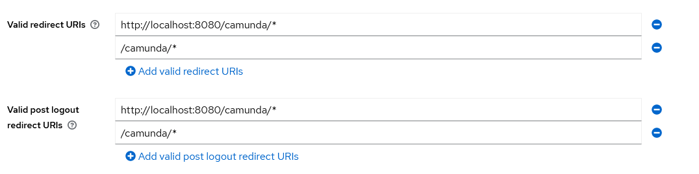

# Camunda Platform 7 - Showcase for Spring Boot & Keycloak Identity Provider

## What it does

This is a basic showcase for a Camunda Platform 7 Spring Boot application using the [Keycloak Identity Provider Plugin](https://github.com/camunda-community-hub/camunda-platform-7-keycloak) in combination with the OAuth 2.0 Client and Resource Server implementation of Spring Security.

You will not only login using Keycloak (or if configured using your preferred social identity provider)

 

but most importantly get Users and Groups in Camunda managed by Keycloak as well

 

## Prerequisites

* In order to run the project as Spring Boot App you will need JDK 8, Maven.
* The optional Docker build requires only Docker itself. It uses JDK 11, Maven within a multi-stage Docker build.
* The optional Kubernetes setup requires the NGINX Ingress Controller.

## Build process

The build process uses Maven.

<table>
    <tr>
        <td><b>Target</b></td>
        <td>&nbsp;</td>
        <td><b>Maven Goal</b></td>
    </tr>
    <tr>
        <td>Build Spring Boot Jar</td>    
        <td>&nbsp;</td>
        <td><code>clean install</code></td>    
    </tr>
    <tr>
        <td>Run Spring Boot App</td>
        <td>&nbsp;</td>
        <td><code>spring-boot:run</code></td>
    </tr>
    <tr>
        <td>Build Docker Image</td>
        <td>&nbsp;</td>
        <td><code>spring-boot:build-image</code></td>
    </tr>
</table>

## Show me the important parts

The following description is a quick start. A more detailed description will follow.

### Run it

1.  Start Keycloak Server as described below.
2.  Run this project as Spring Boot App.
3.  Point a new private window of your browser to ``localhost:8080/camunda``
4.  Login with camunda / camunda1!
5.  Choose the admin console and browse users and groups from Keycloak

### Keycloak server - local test setup

Use a ``docker-compose.yml`` file as follows:

```docker-compose
version: "3.9"

services:
  jboss.keycloak:
    image: gunnaraccso/keycloak.server:24.0.3
    restart: unless-stopped
    environment:
      TZ: Europe/Berlin
      DB_VENDOR: h2
      KEYCLOAK_ADMIN: keycloak
      KEYCLOAK_ADMIN_PASSWORD: keycloak1!
      KC_HTTP_RELATIVE_PATH: /auth
    ports:
      - "9001:8443"
      - "9000:8080"
    command:
      - start-dev
      - --features admin-fine-grained-authz
```

The image ``gunnaraccso/keycloak.server`` has been derived from the original ``quay.io/keycloak/keycloak`` docker image. It additionally includes a basic test setup matching the test configuration of this project. The image exists only for demonstration purposes. Do not use in production. For original Keycloak docker images see [Keycloak Docker images](https://quay.io/repository/keycloak/keycloak?tab=tags&tag=latest).

The only thing you have to adapt for local tests is the **Redirect URI** of the Camuna Identity Service Client. Login at the [Keycloak Admin Console](https://localhost:9001/auth/admin/master/console/#/) using user/password as configured above and add ``http://localhost:8080/camunda/*`` as Valid Redirect URI configuration to the Camunda Identity Service client:

 

Beginning with Keycloak 18, you do not only have to configure a valid redirect URL, but
a valid post logout redirect URL as well. To keep things easy values can be the same:


For further details on how to setup a Keycloak Camunda Identity Service Client see documentation of [Keycloak Identity Provider Plugin](https://github.com/camunda-community-hub/camunda-platform-7-keycloak). The optional setup for securing Camunda's REST Api is described in the chapters below.

### Keycloak Identity Provider Plugin

The class ``KeycloakIdentityProvider.java`` in package ``org.camunda.bpm.extension.keycloak.showcase.plugin`` will activate the plugin.

The main configuration part in ``applicaton.yaml`` is as follows:

```yml
# Externalized Keycloak configuration
keycloak:
  # Keycloak access for the Identity Provider plugin.
  url.plugin: ${KEYCLOAK_URL_PLUGIN:http://localhost:9000}

  # Keycloak Camunda Identity Client
  client.id: ${KEYCLOAK_CLIENT_ID:camunda-identity-service}
  client.secret: ${KEYCLOAK_CLIENT_SECRET:42xx42xx-a17b-c63d-e26f-42xx42xx42xx42xx}

# Camunda Keycloak Identity Provider Plugin
plugin.identity.keycloak:
  keycloakIssuerUrl: ${keycloak.url.plugin}/realms/camunda
  keycloakAdminUrl: ${keycloak.url.plugin}/admin/realms/camunda
  clientId: ${keycloak.client.id}
  clientSecret: ${keycloak.client.secret}
  useEmailAsCamundaUserId: false
  useUsernameAsCamundaUserId: true
  useGroupPathAsCamundaGroupId: true
  administratorGroupName: camunda-admin
  disableSSLCertificateValidation: true
```
If you run Keycloak in the new Quarkus distribution, please be aware that `/auth` has been removed from the default context path.
In case you run the derived legacy image still containing Wildfly (e.g. `gunnaraccso/keycloak.server:19.0.3-legacy`), your
KEYCLOAK_URL_PLUGIN must have the `auth` path added to it, e.g. `http://localhost:9000/auth`.

For configuration details of the plugin see documentation of [Keycloak Identity Provider Plugin](https://github.com/camunda-community-hub/camunda-platform-7-keycloak) 

### OAuth2 SSO Configuration

For OAuth2 SSO configuration see package ``org.camunda.bpm.extension.keycloak.showcase.sso``.

The additional configuration parts in ``applicaton.yaml`` are as follows:

```yml
# Externalized Keycloak configuration
keycloak:
  # SSO Authentication requests. Send by application as redirect to the browser
  url.auth: ${KEYCLOAK_URL_AUTH:http://localhost:9000}
  # SSO Token requests. Send from the application to Keycloak
  url.token: ${KEYCLOAK_URL_TOKEN:http://localhost:9000}

# Spring Boot Security OAuth2 SSO
spring.security.oauth2:
  client:
    registration:
      keycloak:
        provider: keycloak
        client-id: ${keycloak.client.id}
        client-secret: ${keycloak.client.secret}
        authorization-grant-type: authorization_code
        redirect-uri: "{baseUrl}/{action}/oauth2/code/{registrationId}"
        scope: openid, profile, email
    provider:
      keycloak:
        issuer-uri: ${keycloak.url.auth}/realms/camunda
        authorization-uri: ${keycloak.url.auth}/realms/camunda/protocol/openid-connect/auth
        user-info-uri: ${keycloak.url.auth}/realms/camunda/protocol/openid-connect/userinfo
        token-uri: ${keycloak.url.token}/realms/camunda/protocol/openid-connect/token
        jwk-set-uri: ${keycloak.url.token}/realms/camunda/protocol/openid-connect/certs
        # set user-name-attribute one of: 
        # - sub                -> default; using keycloak ID as camunda user ID
        # - email              -> useEmailAsCamundaUserId=true
        # - preferred_username -> useUsernameAsCamundaUserId=true
        user-name-attribute: preferred_username
```

Again: if you run Keycloak in the new Quarkus distribution, please be aware that `/auth` has been removed from the default context path.
In case you run the derived legacy image still containing Wildfly (e.g. `gunnaraccso/keycloak.server:19.0.3-legacy`), your
KEYCLOAK_URL_AUTH /  KEYCLOAK_URL_TOKEN must have the `auth` path added to them, e.g. `http://localhost:9000/auth`.

You'll find the security configuraton setup in ``WebAppSecurityConfig``. Please be aware of the ``KeycloakAuthenticationProvider`` which is the bridge between Spring Security and Camunda.

### Optional Security for the Camunda REST Api

In order to secure Camunda's REST Api we're using standard JWT combined with Keycloaks JWKS capabilities. Which implies

* In order to use the engine's REST interface a client must first obtain a token from the Keycloak server
* This token must be included in the REST request as authentication header
* The job of the REST Api Security is to validate the token and then extract user id and groupIds
* The token signature is checked by requesting the corresponding public key from Keycloak using its JWKS endpoint
* Further token validation includes expiry and audience claims

The additional configuration in ``application.yaml`` is simple and self explaining:

```yml
# Camunda Rest API
rest.security:
  enabled: true
  provider: keycloak
  required-audience: camunda-rest-api
```

To induce keycloak to include the expected audience claim in delivered tokens, we configure a custom Client Scope named ``camunda-rest-api``:


We need to add a mapper with type ``Audience`` and configure the required audience ``camunda-rest-api``


Finally we assign the created Client Scope to our existing Camunda-Identity-Service used for authentication:


This ensures, that only users authenticated at the Camunda-Identity-Service are allowed to access Camunda's REST API. Fine grained configuration of the authorization rights can be achieved by adding rules to Camunda's Authorization configuration.

The security implementation snippets for the REST Api part can be found in package ``org.camunda.bpm.extension.keycloak.showcase.rest``. 

Besides a typical Web security configuration ``RestApiSecurityConfig`` including OAuth 2.0 Resource Server support we need a ``KeycloakAuthenticationFilter`` registered at the end of the Spring Security Filter Chain. Its job is to pass the authenticated user id and groupIds to Camunda's IdentityService:

```java
@Override
public void doFilter(ServletRequest request, ServletResponse response, FilterChain chain)
        throws IOException, ServletException {

    // Extract user-name-attribute of the JWT / OAuth2 token
    Authentication authentication = SecurityContextHolder.getContext().getAuthentication();
    String userId = null;
    if (authentication instanceof JwtAuthenticationToken) {
        userId = ((JwtAuthenticationToken)authentication).getTokenAttributes().get(userNameAttribute).toString();
    } else if (authentication.getPrincipal() instanceof OidcUser) {
        userId = ((OidcUser)authentication.getPrincipal()).getName();
    } else {
        throw new AccessDeniedException("Invalid authentication request token");
    }
    if (StringUtils.isEmpty(userId)) {
        throw new AccessDeniedException("Unable to extract user-name-attribute from token");
    }

    LOG.debug("Extracted userId from bearer token: {}", userId);

    try {
        identityService.setAuthentication(userId, getUserGroups(userId));
        chain.doFilter(request, response);
    } finally {
        identityService.clearAuthentication();
    }
}
```

The REST API URL for this example is `http://localhost:8080/camunda/engine-rest`. Every request requires a JWT token from Keycloak.

A unit test checking the REST Api security is provided in class ``RestApiSecurityConfigTest``. Please be aware that the unit test requires a running Keycloak Server including the setup described above. Therefore it is ignored as standard.

### Logging out from Cockpit

Doing a SSO logout (assuming that this is desired) using the Camunda Cockpit's logout menu button requires us to send a logout request to Keycloak. In order to achieve this we have to replace the original logout functionality, then delegate the logout to our own logout handler which in turn redirects the logout request to Keycloak.

#### Replacing the original logout

In order to replace the UI's logout functionality you have to provide a custom ``config.js`` file, located in the ``app/{admin|tasklist|welcome}/scripts/`` directory of the Camunda webapps. You'll find the custom configuration under ``src/main/resources/META-INF/resources/webjars/camunda`` of this showcase. It simply configures a custom logout script:

```javascript
export default {
  customScripts: [
    'custom/logout'
  ]
};
```

The configured script replaces the logout button functionality as follows:

```javascript
let observer = new MutationObserver(() => {
  // find the logout button
  const logoutButton = document.querySelectorAll(".logout > a")[0];
  // once the button is present replace it with new functionality
  if (logoutButton) {
    var parent = logoutButton.parentElement
    parent.removeChild(logoutButton)
    var newLogout = document.createElement('a');
    newLogout.setAttribute('className', 'ng-binding')
    newLogout.innerText = logoutButton.innerText.replaceAll('\n', '');
    newLogout.setAttribute('href', 'logout'); // call server side logout handler
    parent.appendChild(newLogout)
    observer.disconnect();
  }
});

observer.observe(document.body, {
  childList: true,
  subtree: true,
  attributes: false,
  characterData: false
});
```

With that in place we get a custom logout request to the server, which can be handled by our Keycloak specific logout handler.

#### Providing a logout handler

In order to provide a Keycloak specific logout handler, we first have to add the handler to the WebAppSecurity configuration:

```java
@Inject
private KeycloakLogoutHandler keycloakLogoutHandler;

@Bean
@Order(2)
public SecurityFilterChain httpSecurity(HttpSecurity http) throws Exception {
  return http
    ...
    .oauth2Login(withDefaults())
    .logout(logout -> logout
      .logoutRequestMatcher(antMatcher("/app/**/logout"))
      .logoutSuccessHandler(keycloakLogoutHandler)
    )
    .build();
}
```

The handler itself (see ``org.camunda.bpm.extension.keycloak.showcase.sso.KeycloakLogoutHandler``) takes care of sending an appropriate redirect to Keycloak. The redirect URI will look similar to
``http://<keycloak-server>/realms/camunda/protocol/openid-connect/logout?redirect_uri=http://<camunda-server>/camunda``.

So the logout button now redirects to the Keycloak logout URL which then redirects back to the Camunda Cockpit. Because we're not authenticated any more, Spring Security will then start a new authentication flow.

#### Logout URL for Keycloak versions < 18.0.0

Within the ``KeycloakLogoutHandler`` there is a small snippet calculating the logout URL which - starting from Keycloak version 18.0.0 looks as follows:

```java
    // Complete logout URL
    String logoutUrl = oauth2UserLogoutUri + "?post_logout_redirect_uri=" + redirectUri + "&id_token_hint=" + ((OidcUser)authentication.getPrincipal()).getIdToken().getTokenValue();
```

When using Keycloak version 17.0.1 or older you'll have to replace this with the following:

```java
    // Complete logout URL
    String logoutUrl = oauth2UserLogoutUri + "?redirect_uri=" + redirectUri;
```

For more detailed information on what has changed in Keycloak 18 see [Keycloak 18.0.0 released](https://www.keycloak.org/2022/04/keycloak-1800-released) chapter "OpenID Connect Logout".

## Kubernetes Setup

Finally - a quick introduction on how to setup Keycloak and this showcase on Kubernetes.


### Docker Image Build

Before we turn to Kubernetes it is necessary to build the Docker image. As we included the ``spring-boot-maven-plugin`` everything is quite simple, just run ``mvn spring-boot:build-image``.

The Docker Image Build is using the `gcr.io/paketo-buildpacks/adoptium` Buildpack having JDK's jlink tool at build time enabled to generate a custom slim JRE.

#### Java module dependencies & jlinked Java 17

Just for the records - how to find out java module dependencies and shrink your JRE:
* Extract ``target/camunda-platform-7-keycloak-examples-sso-kubernetes.jar/BOOT-INF/lib`` to `target/lib``
* Open a shell in ``target`` and run ``jdeps -cp lib/* -R --multi-release 17 --print-module-deps --ignore-missing-deps camunda-platform-7-keycloak-examples-sso-kubernetes.jar``

The result goes to the jlink `add-modules` option in the `BP_JVM_JLINK_ARGS` environment parameter of the `spring-boot-maven-plugin` image configuration.

### Kubernetes

The Kubernetes setup can be found in directory ``k8s``. It contains a subfolder ``keycloak`` setting up the Keycloak test server.

**Keycloak Kubernetes Setup**

In order to make Keycloak run with Kubernetes you have to be aware of two things:
* Activate the ``PROXY_ADDRESS_FORWARDING`` option for Keycloak.
* Activate ``nginx.ingress.kubernetes.io/ssl-redirect`` in your ingress service.
* The Redirect URI within Keycloak's Camunda-Identity-Service Client should be ``/camunda/*``.

Keep in mind that the included ``keycloak/deployment.yaml`` is only a test setup. Adapt to your own needs.

After setting up your Keycloak server you can start the deployment of the showcase.

**Camunda Showcase Kubernetes Setup**

In order to make the Camunda Showcase work the following points are noteworthy:
* You have to activate sticky sessions within the ingress service. We have more than one pod running the showcase!
* Keep in mind, that sticky sessions won't work without a host setting (important for a local test setup) and it is recommended to add a ``session-cookie-path`` (I have seen error reports on that - might be fixed, might be not fixed meanwhile).

You should work through the following points:
* Within the ``deployment.yaml`` of the showcase adapt the image name to your own needs.
* Within the ``deployment.yaml`` of the showcase adapt the environment variable ``KEYCLOAK_URL_AUTH`` to your own host.
* Within the ``localhost/endpoint.yaml`` of the showcase the IP address is the one of ``host.docker.internal``. The showcase uses the endpoint configuration to access the host from the inside of pod. Adapt the name including the service-name (do not forget ``localhost\service.yaml``) to your own host.
* Within the ``ingress-service.yaml`` adapt the host name to your own environment.

### SSL

Since this is just a quick start, I didn't use a full SSL setup including the installation of my own certificates. Sadly the OAuth2 security part of Spring Boot has no option to deactivate SSL certificate validation, which would make a quick test setup much easier. For production keep in mind to use SSL certificates and HTTPS, especially for the login part.

### Outlook

This showcase still works with sticky sessions. It might be worth reading the Camunda blog article [Camunda BPM - Session Management in Cloud Environments](https://blog.camunda.com/post/2019/06/camunda-bpm-with-session-manager/) and integrate the findings.

------------------------------------------------------------

That's it. Have a happy Camunda Keycloak experience and focus on what really matters: the core processes of your customer.

Brought to you by:

[Gunnar von der Beck](https://www.xing.com/profile/Gunnar_vonderBeck/portfolio "XING Profile")
